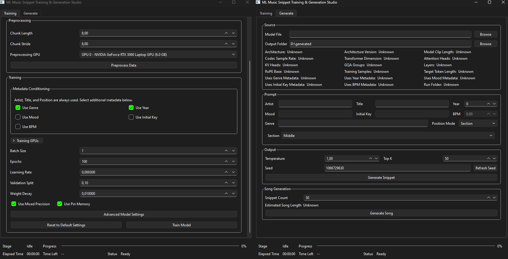

# ML Music Snippet Training & Generation Studio

ML Music Snippet Training & Generation Studio is a desktop application for preprocessing audio, training metadata-conditioned music snippet models, and generating new MP3 snippets from trained models.

The project is intended for local experimentation with your own music collection. It provides a GUI workflow for dataset preparation, model training, model loading, prompt-based generation, and MP3 export.

## Requirements

### FFmpeg

FFmpeg must be installed and available on your system `PATH` for MP3 export to work correctly.

### PyTorch / GPU

The repository uses split requirement files:

- `requirements/base.txt` contains the shared dependencies
- `requirements/windows-cpu.txt` installs the CPU-only PyTorch build for Windows and already includes `base.txt`
- `requirements/windows-cu126.txt` installs the CUDA 12.6 PyTorch build for Windows and already includes `base.txt`

Linux does not currently have a dedicated requirements file in this repository. The code may run on Linux, but dependency installation must be done manually by installing the shared base requirements first and then installing a compatible Linux build of PyTorch and torchaudio.

---

# How to use

## 1. Clone the repository

```bash
git clone https://github.com/MichalKierz/ML-Music-Snippet-Training-Generation-Studio.git
cd ML-Music-Snippet-Training-Generation-Studio
```

## 2. Create a virtual environment (recommended)

Using a virtual environment is recommended, but not strictly required.

### Windows

```bash
python -m venv .venv
.venv\Scripts\activate
```

### Linux

```bash
python3 -m venv .venv
source .venv/bin/activate
```

## 3. Install dependencies

### Windows with NVIDIA GPU and CUDA 12.6 build

```bash
pip install -r requirements/windows-cu126.txt
```

### Windows CPU-only

```bash
pip install -r requirements/windows-cpu.txt
```

### Linux

Install the shared base requirements first:

```bash
pip install -r requirements/base.txt
```

Then install a Linux-compatible build of PyTorch and torchaudio that matches your system and hardware.

## 4. Run the application

```bash
python app.py
```

## 5. Prepare your input audio

Place your source audio files in the folder selected as **Raw Music Folder** inside the application.

### How metadata is resolved

During preprocessing, the application reads metadata from audio tags and resolves:

- artist
- title
- year
- genre
- mood
- initial key
- BPM

For artist and title, the pipeline falls back to filename parsing when embedded tags are missing.

The default filename delimiter is:

```text
 -
```

So a filename like:

```text
Artist - Title.mp3
```

works well when embedded tags are missing.

## 6. Preprocess the dataset

In the **Training** tab:

1. Select the raw music folder
2. Select the processed training data folder
3. Select the model output folder
4. Choose chunk length, chunk stride, and preprocessing device
5. Click **Preprocess Data**

This step builds the processed dataset used for training.

## 7. Train a model

In the **Training** tab:

1. Configure the training settings
2. Configure optional metadata conditioning
3. Open **Advanced Model Settings** if you want to change the transformer size
4. Click **Train Model**

The trained model will be saved to the selected models folder.

## 8. Generate a snippet

In the **Generate** tab:

1. Select a trained model
2. Choose the output folder
3. Enter the prompt values
4. Set generation controls such as temperature, top-k, and seed
5. Click **Generate Snippet**

The app exports the result as an MP3 file.

## 9. Generate a full song

In the **Song Generation** section:

1. Set the snippet count
2. Click **Generate Song**

The app generates multiple snippets, decodes them to waveform audio, stitches them together, and exports one longer MP3 file.

---

# Architecture

## Preprocessing

The preprocessing stage turns a normal music folder into a token dataset that the model can train on.

First, the application scans the input folder and indexes the available audio files. During this step it reads metadata from audio tags and resolves artist and title with a filename fallback when needed.

After indexing, each track is split into fixed-length chunks according to the selected chunk length and stride. For every chunk, the preprocessing pipeline also stores its time window and relative position inside the source track. Each chunk is then encoded into discrete codec tokens with the DAC codec. The result is a token dataset where every chunk is represented as a sequence of integers together with its associated metadata and song-position information.

The preprocessing step writes several outputs into the processed training data folder:

- a library manifest
- a chunk manifest
- token cache files
- codec information
- preprocessing configuration
- metadata vocabulary files

This processed dataset becomes the input to the training pipeline.

## Training

The training pipeline learns an autoregressive model over codec token sequences.

For each training example, the dataset loads one tokenized chunk and builds the model input in next-token-prediction format. A BOS token is added to the input sequence, and the target sequence is shifted so the model learns to predict the next token at each position. The batch collator pads sequences and builds an attention mask.

Metadata is encoded separately from the audio tokens. Artist, title, and position are always used. Optional metadata such as genre, year, mood, initial key, and BPM can also be enabled. Title is encoded as a padded character sequence, categorical fields are mapped to IDs, and numeric fields such as year, relative position, and BPM are normalized before being passed to the model.

The core model is a decoder-only transformer with causal self-attention. It uses RoPE positional encoding, RMSNorm, and SwiGLU feedforward blocks. Instead of inserting metadata as plain text tokens, the model builds a learned conditioning prefix from the metadata and prepends those conditioning states before the audio token sequence.

Training is optimized for practical local use:

- token-budget batching groups samples by sequence length and token budget
- warmup plus cosine learning rate scheduling improves training stability
- EMA smooths the learned weights over time
- top-checkpoint averaging reduces dependence on a single lucky epoch
- the final saved model is selected from the best training trajectory instead of blindly taking the last epoch

The output of training is a self-contained model file that includes the trained weights, model configuration, embedded metadata vocabulary, codec information, and training metadata needed for inference.

## Generation

Generation starts by loading a trained model together with its embedded metadata vocabulary and codec information.

When you enter a prompt, the application converts the provided values into the same metadata representation used during training. Position can be supplied as start time, relative position, or section label. Start time is converted to a relative position using the model reference track duration, and section labels are mapped to fixed relative positions.

The model then generates audio tokens autoregressively. Generation uses a prefill step followed by token-by-token decoding with a KV cache instead of recomputing the entire sequence from scratch every step. This makes inference much faster than naive full-sequence decoding.

At each step, the next token is chosen using the selected sampling controls such as temperature and top-k. After enough tokens are generated, the tokens are decoded back into waveform audio through the codec and exported as an MP3 file.

For full-song generation, the app generates multiple snippets in sequence, spaces them across the song timeline with relative positions, decodes each snippet, concatenates the waveform parts, and exports one stitched MP3 output.

---

# Output folders

The application uses several working folders:

- `training_input` — source music files
- `processed_training_data` — processed token dataset
- `models` — trained model files
- `generated` — generated MP3 files
- `logs` — runtime logs

---

# Notes

- Linux may work, but this repository currently provides ready-to-use dependency presets only for Windows.
- GPU support depends on your local PyTorch and CUDA environment.
- Training and generation speed depend heavily on model size, chunk length, dataset size, and GPU VRAM.
- Larger models and longer snippets require substantially more memory and time.

---

# License

This project is licensed under the MIT License. See the `LICENSE` file for details.
